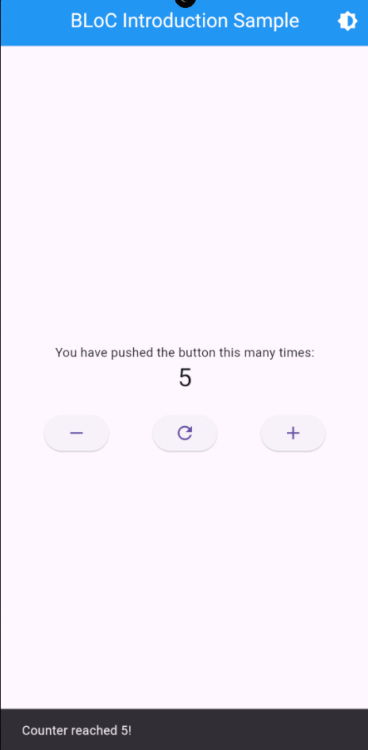
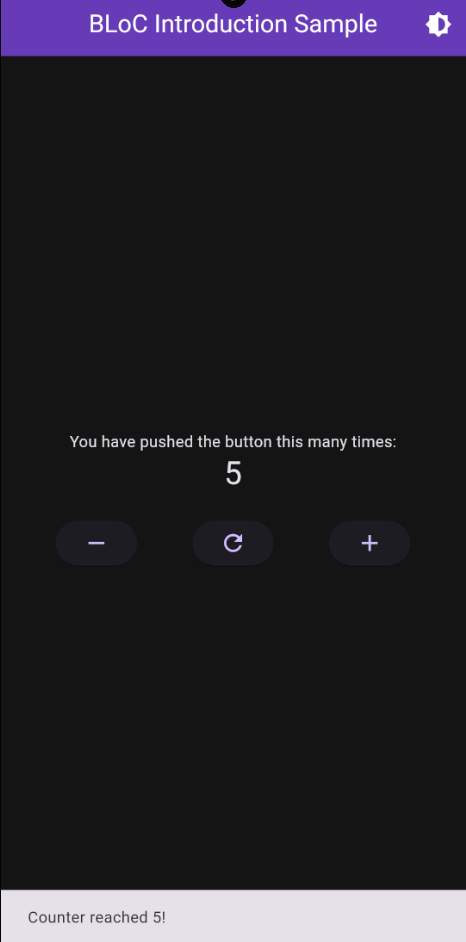

# Introduction to BLoC State Management

This application demonstrates the use of **BLoC (Business Logic Component)** for state management in Flutter. It features two independent BLoCs:

1. **CounterBloc**: Manages counter functionality (increment, decrement, reset).
2. **ThemeBloc**: Handles theme toggling between light and dark themes.

## Key Features:
- **Dynamic State Updates**:  
  Using `BlocConsumer`, the app listens to state changes and rebuilds the UI accordingly. For example:
  - **Counter Events**: Buttons trigger counter actions (decrement, reset, or increment).
  - **Theme Toggle**: A dedicated button allows users to switch between light and dark themes.
  
- **SnackBar Notification**:  
  A SnackBar appears when the counter value reaches `5`!

## Project Structure:
- **Modular BLoC Files**:  
  Each BLoC (`CounterBloc` and `ThemeBloc`) is organized in its own folder under the `blocs` folder for clarity and maintainability.

- **Centralized Theme Management**:  
  The app's `light` and `dark` themes are defined in a separate `themes.dart` file to promote a clean and scalable structure.

## Example Screenshots:

### Light Theme  

### Dark Theme  

